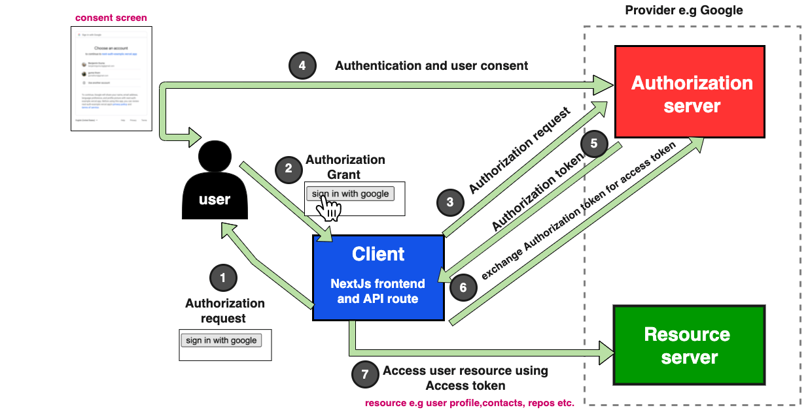
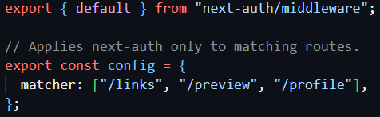

# Quick Links (in development)

This is a link-sharing app where users can create a profile and share social media links and more.

This app has been adapted from [Frontend Mentor's challenge](https://www.frontendmentor.io/challenges/linksharing-app-Fbt7yweGsT). [Vercel's fullstack app guide](https://vercel.com/guides/nextjs-prisma-postgres) was used in the initial planning of the app structure; however, this guide uses the pages router and I intend on using the app router.

## Current Development Roadmap

- create user account in db when user first logs in
- autofill profile info based on user info (email), name if available
- add CRUD functionality
- set up authentication with NextAuth (github DONE - TODO: add Google test user, custom credentials)
- add input validations
- style frontend
- update roadmap to include additional tasks after major tasks are completed

## Users will be able to:

- Create an account and log in
- Create, read, update, delete links and see previews in the mobile mockup (details are saved to a database)
- Receive validations if the links form is submitted without a URL or with the wrong URL pattern for the platform
- Drag and drop links to reorder them
- Add profile details like profile picture, first name, last name, and email
- Receive validations if the profile details form is saved with no first or last name
- Preview their devlinks profile and copy the link to their clipboard
- View the optimal layout for the interface depending on their device's screen size
- See hover and focus states for all interactive elements on the page
- Customise their links profile theme

## Development Notes

### NextAuth.js Library

I chose this because it will integrate well with Next.js, PostgreSQL, and Vercel. I followed the instructions for getting started from the [NextAuth documentation](https://next-auth.js.org/getting-started/example).

First, I installed next-auth:

npm install next-auth

#### OAuth Flow

#### Initialisation

The NextAuth method imported from next-auth handles different types of requests.

Since I'm using the new App Router, I've initialised NextAuth.js with a route handler under app/api/auth/[...nextauth]/route.ts. [...nextauth] is a dynamic segment that will catch all subsequent segments following /app/api/auth/nextauth. I've followed the [NextAuth guide](https://next-auth.js.org/configuration/initialization#route-handlers-app) for this.

To get started, I setup GitHub as a provider in the nextauth route handler. Then I added sign in and sign out options to the homepage. The signIn() and signOut() functions need to be used in client components, so I created SignIn and SignOut client components that I could import into the homepage.

##### Middleware

To protect the links, preview, and profile pages when the user isn't signed in, I used [middleware](https://next-auth.js.org/tutorials/securing-pages-and-api-routes#nextjs-middleware). This prevents somebody from using the url to access these pages without signing in. If they go to quicklinks.com/links, they will be redirected to sign in.

src/middleware.ts

### Setting up a Postgres DB

#### Creating database schema

I'm using Prisma Migrate, since this allows for keeping the database schema in sync with the Prisma schema as it evolves. It generates a history of .sql migration files.

Starting out, I believe I need to create tables for Links to store information about the url, platform name, and the user that created the link, and a table for the user Profile, to store their name, email, and other information. I'm not sure at this stage whether I need to also create a table for the User. I plan on using NextAuth, which will provide the user authentication information for me. So do I also need a table to store this information?

Some developers suggest that it's important to plan for the unknown future, and that if a transition into a different service were ever necessary, it would be helpful to maintain user data outside of NextAuth.

##### .env

After writing my initial Prisma schema, running npx prisma migrate dev --name init results in this error:

error: Environment variable not found: DATABASE_URL.
--> schema.prisma:10
|
9 | provider = "postgresql"
10 | url = env("DATABASE_URL")

[Next.js](https://nextjs.org/docs/pages/building-your-application/configuring/environment-variables#loading-environment-variables) recommends using a .env.local file to store env variables. Prisma uses .env. Due to this conflict, I needed to use the dotenv-cli package to [specify which environment file Prisma should use when running a migration](https://www.prisma.io/docs/orm/more/development-environment/environment-variables/using-multiple-env-files#running-migrations-on-different-environments).
