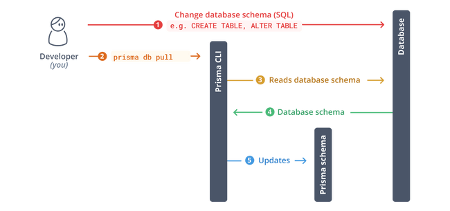

# Quick Links (in development)

This is a link-sharing app where users can create a profile and share social media links and more.

This app has been adapted from [Frontend Mentor's challenge](https://www.frontendmentor.io/challenges/linksharing-app-Fbt7yweGsT). [Vercel's fullstack app guide](https://vercel.com/guides/nextjs-prisma-postgres) was used in the initial planning of the app structure; however, this guide uses the pages router and I intend on using the app router.

## Current Development Roadmap

- create next app and create basic unstyled frontend (DONE)
- set up Vercel Postgres database
- set up Prisma and create the database schema
- install and generate Prisma client
- add CRUD functionality
- set up authentication with NextAuth
- add log in functionality
- add input validations
- style frontend
- update roadmap to include additional tasks after major tasks are completed

## Users will be able to:

- Create an account and log in
- Create, read, update, delete links and see previews in the mobile mockup (details are saved to a database)
- Receive validations if the links form is submitted without a URL or with the wrong URL pattern for the platform
- Drag and drop links to reorder them
- Add profile details like profile picture, first name, last name, and email
- Receive validations if the profile details form is saved with no first or last name
- Preview their devlinks profile and copy the link to their clipboard
- View the optimal layout for the interface depending on their device's screen size
- See hover and focus states for all interactive elements on the page
- Customise their links profile theme

## Expected behaviour (from Frontend Mentor)

- Links
  - Clicking "Add new link" will add a new repeater where the user can select the platform to add a link for and add the URL.
  - Adding a new link should immediately show the platform's link in the mobile mockup illustration even before the form is saved.
  - When the user clicks "Save", the form should validate for the presence of a URL and ensure the URL pattern is correct for the platform (e.g. "https://www.frontendmentor.io/profile/:username" for the Frontend Mentor link).
  - The user should be able to drag and drop by clicking and holding the two-line hamburger icon in the top left of each link repeater.
  - The mobile mockup illustration isn't shown on tablet and mobile layouts. The user would need to click through to the preview page to see their profile.
- Profile Details
  - First name and last name are the only required fields. If no profile picture or email address are present, remove the necessary parts of the mobile mockup or use the person's initials inside the circle where the profile picture would be.
  - You can use Web APIs like FileReader to handle the image upload. You can do this completely client-side if you're just building the front-end. If you're building full-stack, this is a nice opportunity to integrate with a media hosting service like Cloudinary and practice using their API. Remember to keep your API credentials secret if you choose this route!
- Preview
  - Clicking "Share Link" should copy the current URL to the user's clipboard and show the relevant toast message shown in the design.
  - If you're building the project as a full-stack app, ensure only the current user can only see the header with the "Back to Editor" and "Share Link" call-to-actions if they are the same user as the one in the profile. If they're not, the header should disappear and they shouldn't be able to access the admin area.

## Development Notes

### NextAuth.js Library

I chose this because it will integrate well with Next.js, PostgreSQL, and Vercel. I followed the instructions for getting started from the [NextAuth documentation](https://next-auth.js.org/getting-started/example).

Input into the terminal:

npm install next-auth

#### Initialisation

The NextAuth method imported from next-auth handles different types of requests.

Since I'm using the new App Router, I've initialised NextAuth.js with a route handler under app/api/auth/[...nextauth]/route.ts. [...nextauth] is a dynamic segment that will catch all subsequent segments following /app/api/auth/nextauth. I've followed the [NextAuth guide](https://next-auth.js.org/configuration/initialization#route-handlers-app) for this.

To get started, I setup GitHub as a provider in the nextauth route handler. Then I added sign in and sign out options to the homepage. The signIn() and signOut() functions need to be used in client components, so I created SignIn and SignOut client components that I could import into the homepage.

##### The difference between useSession, getSession, and getServerSession

https://stackoverflow.com/questions/77093615/difference-between-usesession-getsession-and-getserversession-in-next-auth

- useSession is a React hook and can only be called at the top of a client component.
- getSession gives the session in a client component without following the rules of hooks.
- getServerSession gives the session server-side (Route handlers, React server components).

##### Middleware

To protect pages when the user isn't signed in, I used [middleware](https://next-auth.js.org/tutorials/securing-pages-and-api-routes#nextjs-middleware). I used matchers for the links, preview and profile pages. Even though I won't have links to these on the homepage, which is simply designed to introduce the app and prompt users to sign in/create an account, this prevents somebody from using the url to access these pages without signing in. If they go to quicklinks.com/links, they will be redirected to sign in.

### Setting up a Postgres DB

I was unsure if I had installed postgreSQL for a previous project that I did not continue with. These are the steps I followed to set up the database:

- Check postgreSQL is installed in cmd with "postgres --version"
- Default username is postgres
- "psql -U postgres" will prompt for a password, which should have been created when you installed postgreSQL
- once logged in, "\du" gives a list of roles
- "\l" lists databases
- I used pgAdmin since I prefer using a GUI

#### Creating database schema

I'm using Prisma Migrate, since this allows for keeping the database schema in sync with the Prisma schema as it evolves. It generates a history of .sql migration files.

Starting out, I believe I need to create tables for Links to store information about the url, platform name, and the user that created the link, and a table for the user Profile, to store their name, email, and other information. I'm not sure at this stage whether I need to also create a table for the User. I plan on using NextAuth, which will provide the user authentication information for me. So do I also need a table to store this information?

Some developers suggest that it's important to plan for the unknown future, and that if a transition into a different service were ever necessary, it would be helpful to maintain user data outside of NextAuth.

##### Table for User?
